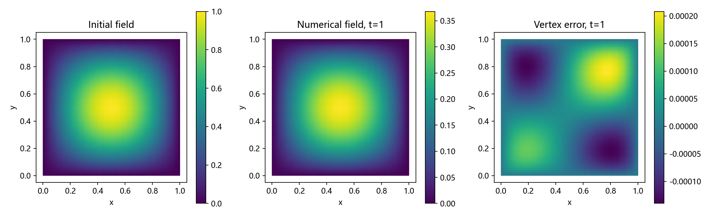
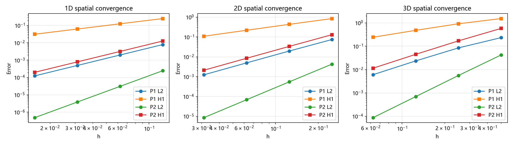
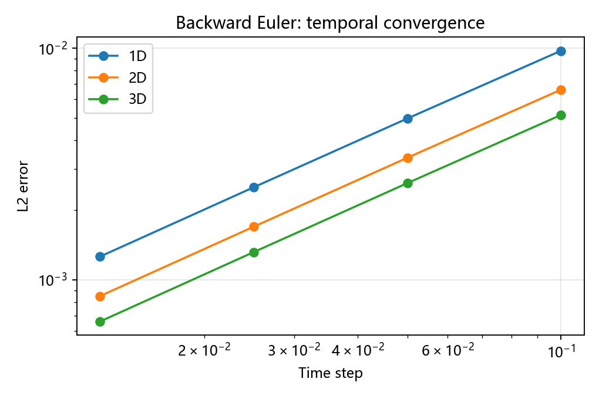

# FEALPy CDR 多维含时有限元求解器

基于 [FEALPy](https://github.com/weihuayi/fealpy) 的对流–扩散–反应（Convection–Diffusion–Reaction, CDR）求解器，支持 **1、2、3 维稳态与含时问题、连续 P1/P2 有限元、变系数和非零 Dirichlet 边界**。项目包含可运行程序、数值算例、独立正确性验证、收敛数据和 ParaView 时间序列。



上图展示二维解从初始状态到 $t=1$ 的演化，以及终态顶点误差。两幅解图的色标范围分别标注，精确峰值从 1 降到约 0.368。

## 方程与数值方法

在盒形区域 $\Omega\subset\mathbb R^m$ 上求解

$$
d(\boldsymbol x,t)\frac{\partial u}{\partial t}
-\nabla\cdot(a(\boldsymbol x,t)\nabla u)
+\boldsymbol b(\boldsymbol x,t)\cdot\nabla u
+c(\boldsymbol x,t)u=f(\boldsymbol x,t).
$$

| 数据 | 含义 | 表达形式 |
| --- | --- | --- |
| $a$ | 标量扩散系数 | 正常数或变系数 |
| $\boldsymbol b$ | 对流速度 | m 个标量分量 |
| $c$ | 反应系数 | 标量 |
| $d$ | 时间容量系数 | 正常数或变系数 |
| $f$ | 源项 | 显式输入或由制造解生成 |
| $g$、$u_0$ | 全边界 Dirichlet 数据、初值 | 空间/时间表达式、空间表达式 |

时间项定义为 $d\,u_t$；若使用 $\partial_t(du)$，时间变化的 d 会引入额外项，需另行建模。系数支持数字、字符串和 SymPy 表达式，包括多项式与三角函数。空间坐标命名为 `x0`、`x1`、`x2`，时间为 `t`。

空间弱形式为

$$
\int_\Omega d u_t v+\int_\Omega a\nabla u\cdot\nabla v
+\int_\Omega(\boldsymbol b\cdot\nabla u)v+\int_\Omega cuv=\int_\Omega fv.
$$

FEALPy 的扩散、对流、质量和源项积分器完成组装，`DirichletBC` 处理边界，`spsolve(..., solver='scipy')` 求解一般非对称的稀疏系统。时间采用一阶后向欧拉：

$$
(M_d^{n+1}+\Delta t A^{n+1})U^{n+1}
=M_d^{n+1}U^n+\Delta t F^{n+1}.
$$

稳态调用 `solve()`，省略时间项；含时调用 `solve_time()`。

## 快速开始

实测环境：Python 3.13.2、FEALPy 3.4.0、NumPy 2.3.4、SciPy 1.16.3、SymPy 1.14.0、Matplotlib 3.10.7、VTK 9.6.2。

```bash
git clone https://github.com/menghuainanfang/FEALPy-project-cdr-solver.git
cd FEALPy-project-cdr-solver
python -m venv .venv
```

激活虚拟环境：Windows PowerShell 使用 `.\.venv\Scripts\Activate.ps1`，Linux/macOS 使用 `source .venv/bin/activate`。然后运行：

```bash
python -m pip install -r requirements_extension.txt
python example_extension.py
python verify_extension.py
```

`example_extension.py` 运行不依赖精确解的二维含时问题。`verify_extension.py` 运行完整扩展验证，生成 CSV、JSON、三张图片、21 个时刻的 VTU/PVD 和 [任务报告](docs/多维含时求解器_任务报告.md)。仓库已附一套实测结果，可直接浏览。

## 定义自己的问题

```python
from fealpy.backend import backend_manager as bm
from fealpy.functionspace import LagrangeFESpace
from pde import CDRData
from cdr_lfem_solver import CDRLFEMSolver, box_mesh

bm.set_backend('numpy')
pde = CDRData(
    dim=2,
    a='1+x0**2+x1**2',
    b=['1+x0', '1+x1'],
    c=2,
    d='1+x0+x1',
    source=1,
    boundary=0,
    initial=0,
)
space = LagrangeFESpace(box_mesh(pde, n=8), p=1)
solver = CDRLFEMSolver(space, pde)
uh = solver.solve_time(end_time=0.2, steps=4, output='my_results')
print(solver.history[-1])
```

默认区域为单位盒；例如 `box=[0,2,0,1]` 表示二维矩形。`n` 是每个坐标方向的分段数，`p` 为 1 或 2。改变维数时同时修改 b 的分量数和表达式中的坐标。

制造解实验可用 `CDRData(2, exact='sin(pi*x0)*sin(pi*x1)')` 自动生成源项、边界和精确梯度。实际题目直接提供 `source`、`boundary`、`initial`，无需知道精确解。

## 数值算例与正确性验证

### 空间收敛：24 组多维实验

取 $u=1+\sum_i x_i+\prod_i\sin(\pi x_i)$，$a=1+\sum_i x_i^2$，$b_i=1+x_i$，$c=2+\sum_i x_i$。由强形式生成源项，边界取精确解。每个维数、每种阶次采用四层网格。

| 维数 | 阶次 | 每方向分段 n | 自由度 | L2 误差 | H1 半范误差 | L2 阶 | H1 阶 |
| --- | --- | --- | --- | --- | --- | --- | --- |
| 1 | P1 | 64 | 65 | 1.23971e-4 | 3.14776e-2 | 2.000 | 1.000 |
| 1 | P2 | 64 | 129 | 4.80939e-7 | 1.99480e-4 | 3.000 | 2.000 |
| 2 | P1 | 32 | 1089 | 1.23907e-3 | 1.08988e-1 | 1.995 | 0.998 |
| 2 | P2 | 32 | 4225 | 8.59825e-6 | 2.10970e-3 | 2.997 | 1.997 |
| 3 | P1 | 16 | 4913 | 6.05981e-3 | 2.42902e-1 | 1.960 | 0.983 |
| 3 | P2 | 16 | 35937 | 8.76602e-5 | 1.14790e-2 | 2.999 | 1.972 |



光滑算例预期的 L2/H1 半范收敛阶为 P1：2/1，P2：3/2。[完整空间数据](results_extension/spatial.csv)。

### 时间收敛：12 组实验

取 $w=1+\sum_i x_i^2$、$u=e^t w$、$d=1+t+\sum_i x_i$，使用上述 a/b/c。固定 n=4、P2，空间可表示 w，以分离时间误差；终止时间为 0.5，时间步数为 5/10/20/40。

| 维数 | 最细时间步 | L2 误差 | 时间收敛阶 |
| --- | --- | --- | --- |
| 1 | 0.0125 | 1.25851e-3 | 0.993 |
| 2 | 0.0125 | 8.49827e-4 | 0.995 |
| 3 | 0.0125 | 6.60127e-4 | 0.995 |



结果符合后向欧拉一阶预期。[完整时间数据](results_extension/temporal.csv)。

### 独立检查

- 手写源项的 $u=(1+t)(1+\sum_i x_i^2)$ 算例同时检验变系数容量、非零时变边界和空间算子，1/2/3 维 L2 误差约为 $10^{-15}$。
- 固定 f，仅将 d 从 1 改为 2，终态自由度最大差约为 0.01810，确认容量系数参与计算。
- 一维稳态新旧接口自由度结果一致。
- 检查施加边界后的相对代数残差小于 $10^{-10}$、边界误差小于 $10^{-11}$。
- VTU 由 VTK 读取器读回；兼容性检查覆盖 1/2/3 维 P1/P2 顶点数值、已有网格数据保留、重复与交替求解。

详见 [verification.json](results_extension/verification.json) 和 [兼容性说明](docs/兼容性说明.md)。兼容性脚本检查导入时保持 PyTorch 后端，因此另外需要安装 PyTorch；这不代表扩展求解器支持 PyTorch 运算：

```bash
python -m pip install torch
python verify_compatibility.py results_extension/compatibility_installed.json
```

## ParaView 可视化

1. 从 [ParaView 官网](https://www.paraview.org/download/) 安装桌面程序。
2. File → Open，打开 [solution.pvd](results_extension/vtu/solution.pvd)，点击 Apply。
3. 颜色字段选择 `u`，显示方式选择 Surface，播放时间序列。
4. 固定颜色范围为 [0,1] 可直观看到振幅衰减；通过 Save Screenshot / Save Animation 导出图片或动画。

PVD 记录 0 到 1 的实际物理时间，间隔 0.05；21 个 VTU 文件保存每个时刻的网格与顶点数据。详见 [ParaView 入门](docs/ParaView入门.md)。

## 项目结构

```text
.
├── pde/cdr_data.py          # 方程系数、初边值、制造解与符号求导
├── cdr_lfem_solver.py       # 多维组装、稳态/含时求解、VTU/PVD 导出
├── example_extension.py    # 无精确解的二维应用示例
├── verify_extension.py     # 多维空间/时间验证、数据和报告生成
├── verify_compatibility.py # FEALPy 接口与共享对象隔离验证
├── requirements_extension.txt
├── docs/                   # 任务报告、兼容性、使用与 ParaView 文档
├── results_extension/      # CSV、JSON、PNG、VTU/PVD
├── cdr_lfem_solver_1d.py    # 一维稳态核心
├── cdr_solver.py           # 一维接口与四组制造解
├── verify_*.py             # 一维单元矩阵、方程和集成验证
└── results/                # 一维稳态实验数据与图片
```

PDE 类描述题目，求解器管理积分器、检查、组装和求解。核心模块不修改全局后端或 FEALPy 公共接口；导出保留调用者的网格数据，自定义线性求解器接收矩阵与右端副本。

一维稳态接口 `solve_cdr` 和 32 组实验继续保留，使用 `python cdr_solver.py`、`python verify_integrators.py`、`python verify_formulation.py` 运行。其设计及完整数据见 [一维任务报告](docs/一维求解器_任务报告.md)。

## 支持范围与限制

- 扩展求解器实测 NumPy/CPU、1/2/3 维盒形区域、连续 P1/P2、全 Dirichlet、正标量扩散与正容量。安装版 FEALPy 3.4.0 与本机开发源码均通过针对性兼容验证。
- 更高维网格、张量扩散、混合边界、自适应时间步和对流稳定化尚未实现；强对流可能出现振荡。积分点正性检查不能证明任意输入的适定性。
- 时间格式为一阶。VTU 输出顶点采样，不包含 P2 单元内部的高阶变化。
- 符号数据使用 NumPy 求值。项目是独立应用模块，尚未注册为 FEALPy 官方模型，也未通过全库测试或其他后端验证。

## 文档

- [多维含时任务报告](docs/多维含时求解器_任务报告.md)
- [扩展版使用说明](docs/扩展版使用说明.md)
- [兼容性说明](docs/兼容性说明.md)
- [ParaView 入门](docs/ParaView入门.md)
- [一维入门说明](docs/一维求解器_入门说明.md)
- [FEALPy 源码](https://github.com/weihuayi/fealpy)
