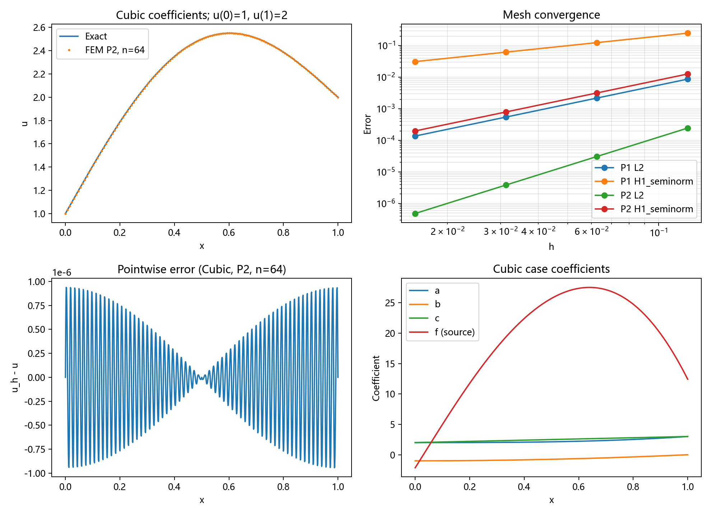
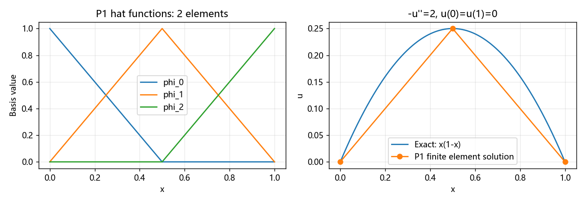

# 一维变系数对流–扩散–反应求解器任务报告

更新日期：2026-09-07。当前主模型：$-(au')'+bu'+cu=f$。本报告替代上一版守恒主模型报告的当前结论；程序保留守恒对照接口。

## 1. 目标与范围

交付可运行程序、设计方案、数值算例、正确性验证与图像。采用一维稳态模型：端点 Dirichlet、连续 P1/P2 有限元。报告结论仅覆盖报告正文明确列出的一维基础范围。

“三项”指左端扩散、对流、反应；右端 f 保留为独立的必需输入。实际 f 可以为零或非零，不局限于多项式。若原题写成已知 d(x)f(x)，可整体作为新源项。

## 2. 设计方案

### 2.1 模型与符号

$$-(a(x)u'(x))'+b(x)u'(x)+c(x)u(x)=f(x),\quad 0<x<1,$$
$$u(0)=g_0,\quad u(1)=g_1.$$

a 是扩散系数，b 是对流系数，c 是零阶系数，f 是源项。要求系数不依赖 u，故求解线性问题。展开扩散后为 $-au''-a'u'+bu'+cu=f$，不能漏掉 a′ 项。

在足够正则、a 一致正、全 Dirichlet 的条件下，一个常用强制性充分条件为 $c-b'/2\ge0$，因为 $A(v,v)=\int a(v')^2+\int(c-b'/2)v^2$。它不是必要条件。主算例均满足该条件，Poisson 由正扩散与端点约束保证。

这是一种含非守恒对流项的数学模型。若需表示总通量 $J=-au'+bu$，对应的守恒反应系数应是 r=c−b′，而不是 r=c。后续物理解释必须遵守这一转换。

### 2.2 弱形式

取零端点检验函数 v，仅对扩散分部积分：

$$\int au'v'+\int bu'v+\int cuv=\int fv.$$

取连续 Lagrange 空间，$u_h=\sum_jU_j\phi_j$，逐个检验可得

$$A=K+B+M_c,\quad K_{ij}=\int a\phi_j'\phi_i',\quad B_{ij}=\int b\phi_j'\phi_i,\quad (M_c)_{ij}=\int c\phi_j\phi_i,$$
$$F_i=\int f\phi_i,\quad AU=F.$$

FEALPy 体积分器分别对应四个积分。系数在积分点求值；默认组装 q=p+4，误差和积分收支使用 q=8。更高次系数需评估积分精度。

### 2.3 实现流程

网格→空间→积分点抽查扩散正性及 Pe→组装 K、B、M_c、F→端点掩码→Dirichlet 矩阵与右端修正→FEALPy spsolve（SciPy CPU 引擎）→误差和验证。

当前安装版本默认一维边界识别存在误选，所以使用仅包含两个端点的布尔掩码。矩阵一般非对称，采用 fealpy.solver.spsolve(...,solver='scipy')。没有修改 FEALPy 库源码。

CdrLFEMSolver1D 是可集成核心，接收调用者创建的有限元空间；solve_cdr 是便捷示例接口；solve_transport 仅保留用于 r=c−b′ 的数学等价性对照。接口都保留 f，不通过全局隐含源项求解。

## 3. 数值算例

统一制造解 $u_*=1+x+\sin(\pi x)$，边界 1、2；四组数据如下：

| 名称 | a | b | c |
| --- | --- | --- | --- |
| poisson | 1 | 0 | 0 |
| variable | 1+x² | 1+x | 2+x |
| reverse | 2+x | 1−2x | 3+x² |
| cubic | 2+x³ | −1+x² | 2+x |

每组 P1/P2、n=8/16/32/64，h=1/n，共 32 次。自由度分别为 n+1 与 2n+1。

令 S=sin(πx)、C=cos(πx)，制造源项的统一表达式为

$$f=a\pi^2 S+(b-a')(1+\pi C)+c(1+x+S).$$

| 算例 | 源项 |
| --- | --- |
| poisson | $\pi^2S$ |
| variable | $(1+x^2)\pi^2S+(1-x)(1+\pi C)+(2+x)(1+x+S)$ |
| reverse | $(2+x)\pi^2S-2x(1+\pi C)+(3+x^2)(1+x+S)$ |
| cubic | $(2+x^3)\pi^2S+(-1-2x^2)(1+\pi C)+(2+x)(1+x+S)$ |

以上表达式已与程序符号求导结果逐项核对。它们是验证算例，不是未经实验标定的实际工况。

## 4. 验证方法与验收标准

L2 误差 $E_0=(\int|u_*-u_h|^2)^{1/2}$；H1 半范误差 $E_1=(\int|u_*'-u_h'|^2)^{1/2}$。经验阶 $s=\log_2(E_h/E_{h/2})$。

光滑稳定算例的预期阶为 P1:2/1、P2:3/2；代码检查最终 L2 阶>p+0.8、H1 半范阶>p−0.2。端点误差<1e-12，施加边界后相对代数残差 $\|AU-F\|/\max(1,\|F\|)<1e-10$。

令扩散通量 $j_d=-au'$，当前方程积分恒等式是

$$j_d(1)-j_d(0)+\int_0^1(bu'+cu-f)=0.$$

程序使用原始有限元梯度检查这个关系，绝对缺陷除以 $\max(1,|j_d(0)|+|j_d(1)|+\int(|bu_h'+cu_h|+|f|))$。要求最后相对缺陷<1%，绝对缺陷较首层至少缩小四倍。这是工程检查，不是局部严格守恒保证；也没有沿用旧模型错误的反应系数收支式。

独立检查包括：单位单元矩阵与手算比较、非零源项作用、全系数多项式精确再现、两形式转换、强对流限制案例。

## 5. 实测结果

### 5.1 最细网格汇总

| 算例 | p | n | L2 | H1半范 | L2阶 | H1阶 |
| --- | --- | --- | --- | --- | --- | --- |
| poisson | 1 | 64 | 1.555290e-04 | 3.147724e-02 | 1.9998 | 0.9998 |
| poisson | 2 | 64 | 4.809369e-07 | 1.994773e-04 | 2.9998 | 1.9999 |
| variable | 1 | 64 | 1.239706e-04 | 3.147763e-02 | 2.0000 | 0.9999 |
| variable | 2 | 64 | 4.809394e-07 | 1.994798e-04 | 2.9999 | 1.9999 |
| reverse | 1 | 64 | 1.359920e-04 | 3.147734e-02 | 2.0000 | 0.9998 |
| reverse | 2 | 64 | 4.809252e-07 | 1.994777e-04 | 2.9997 | 1.9999 |
| cubic | 1 | 64 | 1.372318e-04 | 3.147732e-02 | 1.9998 | 0.9998 |
| cubic | 2 | 64 | 4.809449e-07 | 1.994778e-04 | 2.9999 | 1.9999 |

32 次最大相对代数残差 2.807290e-15，最大边界误差 0.000000e+00。64 单元最大相对积分收支缺陷 2.008137e-04。

### 5.2 全部收敛数据

首层无上一层对照，表中记“—”，原 CSV 对应值为 0。

| 算例 | p | n | L2 | H1半范 | L2阶 | H1阶 |
| --- | --- | --- | --- | --- | --- | --- |
| poisson | 1 | 8 | 9.920920e-03 | 2.511818e-01 | — | — |
| poisson | 1 | 16 | 2.486501e-03 | 1.258332e-01 | 1.9964 | 0.9972 |
| poisson | 1 | 32 | 6.220178e-04 | 6.294691e-02 | 1.9991 | 0.9993 |
| poisson | 1 | 64 | 1.555290e-04 | 3.147724e-02 | 1.9998 | 0.9998 |
| poisson | 2 | 8 | 2.456795e-04 | 1.273889e-02 | — | — |
| poisson | 2 | 16 | 3.076328e-05 | 3.189989e-03 | 2.9975 | 1.9976 |
| poisson | 2 | 32 | 3.847078e-06 | 7.978268e-04 | 2.9994 | 1.9994 |
| poisson | 2 | 64 | 4.809369e-07 | 1.994773e-04 | 2.9998 | 1.9999 |
| variable | 1 | 8 | 7.937459e-03 | 2.513760e-01 | — | — |
| variable | 1 | 16 | 1.983729e-03 | 1.258579e-01 | 2.0005 | 0.9981 |
| variable | 1 | 32 | 4.958925e-04 | 6.295001e-02 | 2.0001 | 0.9995 |
| variable | 1 | 64 | 1.239706e-04 | 3.147763e-02 | 2.0000 | 0.9999 |
| variable | 2 | 8 | 2.457604e-04 | 1.274894e-02 | — | — |
| variable | 2 | 16 | 3.076582e-05 | 3.190620e-03 | 2.9979 | 1.9985 |
| variable | 2 | 32 | 3.847158e-06 | 7.978663e-04 | 2.9995 | 1.9996 |
| variable | 2 | 64 | 4.809394e-07 | 1.994798e-04 | 2.9999 | 1.9999 |
| reverse | 1 | 8 | 8.709416e-03 | 2.512260e-01 | — | — |
| reverse | 1 | 16 | 2.176227e-03 | 1.258389e-01 | 2.0007 | 0.9974 |
| reverse | 1 | 32 | 5.439857e-04 | 6.294763e-02 | 2.0002 | 0.9994 |
| reverse | 1 | 64 | 1.359920e-04 | 3.147734e-02 | 2.0000 | 0.9998 |
| reverse | 2 | 8 | 2.452927e-04 | 1.274042e-02 | — | — |
| reverse | 2 | 16 | 3.075123e-05 | 3.190085e-03 | 2.9958 | 1.9977 |
| reverse | 2 | 32 | 3.846702e-06 | 7.978328e-04 | 2.9990 | 1.9994 |
| reverse | 2 | 64 | 4.809252e-07 | 1.994777e-04 | 2.9997 | 1.9999 |
| cubic | 1 | 8 | 8.760087e-03 | 2.512188e-01 | — | — |
| cubic | 1 | 16 | 2.194362e-03 | 1.258378e-01 | 1.9971 | 0.9974 |
| cubic | 1 | 32 | 5.488601e-04 | 6.294749e-02 | 1.9993 | 0.9993 |
| cubic | 1 | 64 | 1.372318e-04 | 3.147732e-02 | 1.9998 | 0.9998 |
| cubic | 2 | 8 | 2.459406e-04 | 1.274106e-02 | — | — |
| cubic | 2 | 16 | 3.077141e-05 | 3.190127e-03 | 2.9986 | 1.9978 |
| cubic | 2 | 32 | 3.847332e-06 | 7.978354e-04 | 2.9997 | 1.9995 |
| cubic | 2 | 64 | 4.809449e-07 | 1.994778e-04 | 2.9999 | 1.9999 |

### 5.3 专门验证 f 的作用

保持 a=1,b=c=0、零端点不变：f=0 解的最大绝对值为 0.000000e+00；f=2 解的最大值为 2.500000e-01，与 $x(1-x)$ 的最大自由度误差为 1.942890e-15。说明源项确实参与求解，而不是被忽略。

另取 a=1+x²,b=1+x,c=2+x、u=1+x²，手算 f=x³−2x²+3x。P2、16 单元最大误差为 3.774758e-14。该题的右端独立手写，不调用制造解生成器。

正确使用 r=c−b′ 后，守恒对照与主接口的自由度差：P1 4.440892e-15、P2 1.665335e-13。如果错误设 r=c，16/32/64 单元误差分别为 1.221469e-01、1.221459e-01、1.221458e-01，不随加密消失。

单位区间、常系数为 1 的 P1 手算矩阵：

$$K=\begin{bmatrix}1&-1\\-1&1\end{bmatrix},\quad B=\begin{bmatrix}-1/2&1/2\\-1/2&1/2\end{bmatrix},\quad M=\frac16\begin{bmatrix}2&1\\1&2\end{bmatrix}.$$

三者与积分器在 1e-13 容差内吻合。这里对流矩阵直接加入主系统，不转置取负。

## 6. 图片展示



图 1 对应 cubic 算例：解与精确解、P1/P2 收敛、单元内部采样误差、a/b/c 和 f 的曲线。源项 f 作为独立曲线展示；点误差不是误差范数。



图 2 是补充的两单元 Poisson 手算示意，帮助理解矩阵和基函数，不计入32次主算例。

## 7. 已知边界

a=0.001,b=1,c=f=0，端点 0、1，P1、32 单元，Pe=15.625。精确解为

$$u=\frac{e^{(x-1)/a}-e^{-1/a}}{1-e^{-1/a}}\in[0,1].$$

数值最小值 -9.113242e-01，出现负值。脚本成功检出此问题不代表该工况通过物理验收；JSON 中 accepted_as_supported=false。

现阶段未实现稳定化、二维、时间项、混合边界、局部守恒重构、严格非负性。正扩散抽查和 Pe 提示不能保证任意输入的适定性及无振荡。需求满足结论仅限本报告明确的一维基础范围。

## 8. 环境与复现

| 组件 | 版本 |
| --- | --- |
| Python | 3.13.2 |
| fealpy | 3.4.0 |
| numpy | 2.3.4 |
| scipy | 1.16.3 |
| sympy | 1.14.0 |
| matplotlib | 3.10.7 |

按 README 创建虚拟环境并安装依赖后：

```powershell
.\run.cmd
```

复跑环境检查、32 组收敛验证、单元矩阵与独立方程检查，并更新 results/ 输出。报告数据来自 2026-09-07 实测，完整数据在 results/。

## 本地 FEALPy 源码补充验证（2026-09-07）

另以本地更新的 FEALPy 开发源码复跑全部检查（用脚本将子进程导入路径指向源码目录，不修改任何安装包或源码仓库），32 组收敛、独立源项、多项式解与形式转换检查均通过；强对流失效现象仍然存在。上表保留正式发布版本（v3.4.0）的实测结果，源码复跑结果单独留存、未随仓库发布，避免不同环境的数据混用。

## 库接口审查与封装（2026-09-07）

核心已拆至 cdr_lfem_solver_1d.py，网格/空间、积分器、组装、边界、稀疏对象、后端运算和线性求解均经 FEALPy 接口。线性求解底层仍使用 SciPy，和本地 PoissonLFEMModel 的直接求解路径一致。SymPy 制造解、CSV、绘图属于应用层，不引入核心。

移除了导入时 bm.set_backend('numpy')；核心不修改 sys.path、不写结果文件、不注册全局模型、不改现有 fem 导出。原生 CSR 转换可能共享内存，故给线性求解器传矩阵/向量副本。保持调用者网格不变，允许同进程多个实例及重复求解；后端切换后复用旧实例会显式报错。

模拟 fealpy.fem.cdr_lfem_solver_1d 模块加载、NumPy P1/P2 与 PyTorch P1 收敛、源项和矩阵接口、实例隔离检查通过。PyTorch P2 被 IntervalMesh 的负步长切片限制阻挡，已显式拒绝；GPU、JAX、CuPy 未验证。

该类可作为独立数值模块的集成候选，不是已经完成 ComputationalModel/PDEModelManager 注册的插件。正式合入仍需维护者确认目录、公共导出、命名、全库测试和审查。未修改任何 FEALPy 仓库源码，不承诺所有版本或任意输入均无问题。

## 9. 完整程序

源文件原文自动嵌入；保留接口、源项、验证和启动器，可按文件名保存运行。

### cdr_lfem_solver_1d.py

```python
"""Reusable 1D CDR finite-element solver; no import-time backend changes.

Target integration location: fealpy/fem/cdr_lfem_solver_1d.py.
No model-manager registration or package export is performed by this module.
"""
import warnings
from fealpy.backend import backend_manager as bm
from fealpy.decorator import cartesian
from fealpy.mesh import IntervalMesh
from fealpy.functionspace import LagrangeFESpace
from fealpy.fem import (BilinearForm, LinearForm, ScalarDiffusionIntegrator,
    ScalarConvectionIntegrator, ScalarMassIntegrator, ScalarSourceIntegrator,
    DirichletBC)
from fealpy.solver import spsolve

__all__ = ['CdrLFEMSolver1D']


class CdrLFEMSolver1D:
    """Solve -(a*u')' + b*u' + c*u = f on a connected interval.

    Parameters a/b/c/f/gd are scalars or Cartesian callables. Callables must
    use the active backend. Scalars return (...); b may return (..., 1).
    space is a caller-owned P1/P2 LagrangeFESpace on an IntervalMesh.
    NumPy/CPU supports P1/P2; PyTorch/CPU supports P1 only. The caller selects backend.
    linear_solver, if supplied, has signature (A, F) -> coefficient vector.
    A/F are FEALPy sparse/backend objects. The default uses FEALPy spsolve
    with solver='scipy'. No files, plots, logger configuration or global
    backend changes are produced. The mesh/space and input arrays are not
    modified. Reassemble on each solve; reuse across backend switches is
    explicitly rejected. c is r for the optional conservative formulation.
    """
    def __init__(self, space, a, b, c, f, gd, *, q=None,
                 formulation='advective', linear_solver=None):
        if not isinstance(space, LagrangeFESpace):
            raise TypeError('space must be a LagrangeFESpace')
        if not isinstance(space.mesh, IntervalMesh) or space.mesh.geo_dimension() != 1:
            raise ValueError('Only a one-dimensional IntervalMesh is supported')
        if space.p not in (1, 2):
            raise ValueError('Only P1 and P2 are validated')
        if formulation not in ('advective', 'conservative'):
            raise ValueError('Unknown formulation')
        self.backend = bm.get_current_backend().backend_name
        if self.backend not in ('numpy', 'pytorch'):
            raise ValueError('Validated backends: numpy and pytorch on CPU')
        if self.backend == 'pytorch' and space.p == 2:
            raise NotImplementedError('PyTorch P2 is blocked by IntervalMesh interpolation_points')
        self.space = space
        self.mesh = space.mesh
        points = space.interpolation_points()
        if str(bm.get_device(points)) != 'cpu':
            raise ValueError('The default sparse direct solve is CPU-only')
        if q is not None and (isinstance(q, bool) or not isinstance(q, int) or q < 1):
            raise ValueError('q must be a positive integer')
        self.q = space.p + 4 if q is None else q
        self.formulation = formulation
        self.linear_solver = linear_solver
        self.a, self.b = self._coefficient(a), self._coefficient(b, vector=True)
        self.c, self.f, self.gd = map(self._coefficient, (c, f, gd))
        # Explicit endpoint mask avoids the current IntervalMesh BC defect.
        xx = points[..., 0]
        left, right = bm.min(xx), bm.max(xx)
        if not bool(right > left):
            raise ValueError('The interval must have positive length')
        self.boundary = (xx == left) | (xx == right)
        if int(bm.sum(self.boundary)) != 2:
            raise ValueError('Expected exactly two endpoint degrees of freedom')
        self.A = self.F = self.uh = None

    @staticmethod
    def _coefficient(value, vector=False):
        if callable(value) and getattr(value, 'coordtype', 'cartesian') != 'cartesian':
            raise ValueError('Coefficients must use Cartesian coordinates')
        @cartesian
        def evaluate(points):
            result = value(points) if callable(value) else value
            result = bm.asarray(result, **bm.context(points))
            shape = points.shape[:-1]
            if vector and result.shape == shape + (1,):
                pass
            else:
                result = bm.broadcast_to(result, shape)
                if vector:
                    result = result[..., None]
            if not bool(bm.all(bm.isfinite(result))):
                raise ValueError('Coefficient/source/boundary values must be finite')
            return result
        return evaluate

    def _check_backend(self):
        if bm.get_current_backend().backend_name != self.backend:
            raise RuntimeError('Backend changed after solver construction')

    def linear_system(self):
        """Return a fresh unconstrained FEALPy sparse matrix and load vector."""
        self._check_backend()
        bcs, _ = self.mesh.quadrature_formula(self.q, 'cell').get_quadrature_points_and_weights()
        points = self.mesh.bc_to_point(bcs)
        diffusion, velocity = self.a(points), self.b(points)[..., 0]
        if bool(bm.any(diffusion <= 0)):
            raise ValueError('Diffusion must be positive at quadrature points')
        h = self.mesh.entity_measure('cell')[:, None]
        self.max_peclet = float(bm.max(bm.abs(velocity) * h / (2 * diffusion)))
        if self.max_peclet > 1:
            warnings.warn(f'Mesh Peclet number {self.max_peclet:.3g} > 1: '
                          'unstabilized Galerkin may oscillate', RuntimeWarning)
        form = BilinearForm(self.space)
        form.add_integrator(ScalarDiffusionIntegrator(coef=self.a, q=self.q))
        form.add_integrator(ScalarMassIntegrator(coef=self.c, q=self.q))
        convection = BilinearForm(self.space)
        convection.add_integrator(ScalarConvectionIntegrator(coef=self.b, q=self.q))
        B = convection.assembly()
        A = form.assembly() + (-B.T if self.formulation == 'conservative' else B)
        rhs = LinearForm(self.space)
        rhs.add_integrator(ScalarSourceIntegrator(source=self.f, q=self.q))
        return A, rhs.assembly()

    def apply_bc(self, A, F):
        """Apply prescribed endpoint values using FEALPy DirichletBC."""
        self._check_backend()
        return DirichletBC(self.space, gd=self.gd, threshold=self.boundary).apply(A, F)

    def solve(self):
        """Return a fresh FEALPy Function; retain constrained A/F for inspection."""
        self._check_backend()
        self.A, self.F = self.apply_bc(*self.linear_system())
        # SciPy may sort shared CSR storage in-place; isolate solver inputs.
        solve_A, solve_F = self.A.copy(), bm.copy(self.F)
        values = (spsolve(solve_A, solve_F, solver='scipy') if self.linear_solver is None
                  else self.linear_solver(solve_A, solve_F))
        values = bm.asarray(values, **bm.context(self.F))
        if values.shape != self.F.shape or not bool(bm.all(bm.isfinite(values))):
            raise ValueError('Linear solver returned an invalid coefficient vector')
        uh = self.space.function()
        uh[:] = values
        self.uh = uh
        self.relative_residual = float(bm.linalg.norm(self.A @ values - self.F)) / max(
            1., float(bm.linalg.norm(self.F)))
        points = self.space.interpolation_points()[self.boundary]
        self.boundary_error = float(bm.max(bm.abs(values[self.boundary] - self.gd(points))))
        return uh
```

### cdr_solver.py

```python
"""1D steady CDR: -(a*u')' + b*u' + c*u = f; source f is required."""
from pathlib import Path
import argparse
import csv
import json
import platform
import warnings
import sys
import importlib.metadata as metadata
import numpy as np
import sympy as sp
from cdr_lfem_solver_1d import CdrLFEMSolver1D
import fealpy
from fealpy.backend import backend_manager as bm
from fealpy.decorator import cartesian
from fealpy.mesh import IntervalMesh
from fealpy.functionspace import LagrangeFESpace
from fealpy.fem import (BilinearForm, LinearForm, ScalarDiffusionIntegrator,
    ScalarConvectionIntegrator, ScalarMassIntegrator, ScalarSourceIntegrator, DirichletBC)

x = sp.Symbol('x', real=True)


def expression_function(expr, vector=False):
    """Convert a SymPy expression to a broadcast-safe FEALPy coefficient."""
    fun = sp.lambdify(x, expr, 'numpy')
    @cartesian
    def evaluate(points):
        xx = points[..., 0]
        values = np.broadcast_to(np.asarray(fun(xx), dtype=float), xx.shape)
        return values[..., None] if vector else values
    return evaluate


def manufactured_case(name):
    if name == 'poisson':
        a, b, c = sp.Integer(1), sp.Integer(0), sp.Integer(0)
    elif name == 'variable':
        a, b, c = 1 + x**2, 1 + x, 2 + x
    elif name == 'reverse':
        a, b, c = 2 + x, 1 - 2*x, 3 + x**2
    elif name == 'cubic':
        a, b, c = 2 + x**3, -1 + x**2, 2 + x
    else:
        raise ValueError(name)
    exact = sp.sin(sp.pi*x) + 1 + x  # Nonzero boundary values: 1 and 2.
    source = -sp.diff(a*sp.diff(exact, x), x) + b*sp.diff(exact, x) + c*exact
    return dict(a=a, b=b, c=c, exact=exact, source=sp.simplify(source))


def _solve(a, b, c, f, gd, n=32, p=1, interval=(0., 1.), q=None, *, formulation):
    """NumPy example adapter around the independently reusable FEALPy core."""
    if bm.get_current_backend().backend_name != 'numpy':
        raise RuntimeError('This SymPy/NumPy example requires numpy; use the core for PyTorch')
    if isinstance(n, bool) or not isinstance(n, int) or n < 1:
        raise ValueError('n must be a positive integer')
    if len(interval) != 2 or not np.all(np.isfinite(interval)) or interval[0] >= interval[1]:
        raise ValueError('Expected finite increasing interval endpoints')
    mesh = IntervalMesh.from_interval_domain(list(interval), nx=n)
    space = LagrangeFESpace(mesh, p=p)
    model = CdrLFEMSolver1D(space, a, b, c, f, gd, q=q, formulation=formulation)
    uh = model.solve()
    return mesh, space, uh, model.relative_residual, model.boundary_error


def solve_transport(a, b, r, f, gd, n=32, p=1, interval=(0., 1.), q=None):
    """Comparison API: (-a*u' + b*u)' + r*u = f; prescribed endpoint values.

    No velocity derivative is required. r denotes the conservative reaction.
    """
    return _solve(a, b, r, f, gd, n, p, interval, q, formulation='conservative')


def solve_cdr(a, b, c, f, gd, n=32, p=1, interval=(0., 1.), q=None):
    """Main API: -(a*u')' + b*u' + c*u = f. f is an independent source input."""
    return _solve(a, b, c, f, gd, n, p, interval, q, formulation='advective')


def equation_balance(mesh, uh, case):
    """Integrated PDE balance using diffusive flux j=-a*u'.

    CG FEM does not guarantee exact cellwise balance. This residual must converge.
    """
    ends = np.array([[0.], [1.]])
    gradients = uh.grad_value(np.array([[1., 0.], [0., 1.]]))
    du = np.array([gradients[0, 0, 0], gradients[-1, 1, 0]])
    values = uh(np.array([[1., 0.], [0., 1.]]))
    uend = np.array([values[0, 0], values[-1, 1]])
    flux = -expression_function(case['a'])(ends)*du
    bcs, weights = mesh.quadrature_formula(8, 'cell').get_quadrature_points_and_weights()
    points = mesh.bc_to_point(bcs)
    reaction = (expression_function(case['b'])(points)*uh.grad_value(bcs)[..., 0]
                + expression_function(case['c'])(points)*uh(bcs))
    source = expression_function(case['source'])(points)
    measure = mesh.entity_measure('cell')
    integral = np.einsum('q,cq,c->', weights, reaction-source, measure)
    abs_integral = np.einsum('q,cq,c->', weights, np.abs(reaction)+np.abs(source), measure)
    imbalance = float(flux[1]-flux[0]+integral)
    scale = max(1., float(np.sum(np.abs(flux))+abs_integral))
    return abs(imbalance), abs(imbalance)/scale


def run(output):
    bm.set_backend('numpy')  # Explicit application-level choice, never on import.
    output.mkdir(parents=True, exist_ok=True)
    rows = []
    last = None
    for name in ('poisson', 'variable', 'reverse', 'cubic'):
        case = manufactured_case(name)
        exact = expression_function(case['exact'])
        gradient = expression_function(sp.diff(case['exact'], x), vector=True)
        for p in (1, 2):
            previous = None
            for n in (8, 16, 32, 64):
                mesh, space, uh, residual, boundary = solve_cdr(
                    expression_function(case['a']), expression_function(case['b'], True),
                    expression_function(case['c']), expression_function(case['source']), exact, n, p)
                l2 = float(mesh.error(exact, uh, q=8))
                h1 = float(mesh.error(gradient, uh.grad_value, q=8))
                balance, relative_balance = equation_balance(mesh, uh, case)
                row = dict(equation_balance=balance, relative_equation_balance=relative_balance, case=name, p=p, n=n, dofs=space.number_of_global_dofs(),
                    L2=l2, H1_seminorm=h1,
                    L2_order=np.log2(previous[0]/l2) if previous else 0.,
                    H1_order=np.log2(previous[1]/h1) if previous else 0.,
                    relative_residual=residual, boundary_error=boundary)
                rows.append(row)
                print(f'{name:8} P{p} n={n:3} L2={l2:.3e} H1semi={h1:.3e} '
                      f'orders={row["L2_order"]:.2f}/{row["H1_order"]:.2f} residual={residual:.2e}')
                assert np.isfinite(l2+h1) and residual < 1e-10 and boundary < 1e-12
                previous = l2, h1
                last = mesh, space, uh, case
            assert row['L2_order'] > p + .8, row
            assert row['H1_order'] > p - .2, row
            assert row['relative_equation_balance'] < .01, row
            data = [r for r in rows if r['case']==name and r['p']==p]
            assert data[-1]['equation_balance'] < data[0]['equation_balance']/4, data
    with (output/'convergence.csv').open('w', newline='', encoding='utf-8') as file:
        writer = csv.DictWriter(file, fieldnames=rows[0].keys())
        writer.writeheader()
        writer.writerows(rows)
    run_metadata = dict(formulation='advective', equation="-(a*u')' + b*u' + c*u = f", reaction_symbol='c', python=platform.python_version(), executable=sys.executable, versions={name: metadata.version(name) for name in ("fealpy", "numpy", "scipy", "sympy", "matplotlib")}, fealpy_path=fealpy.__file__,
                    numpy=np.__version__, cases={k: {s: str(v) for s,v in manufactured_case(k).items()}
                                              for k in ('poisson','variable','reverse','cubic')})
    (output/'run_info.json').write_text(json.dumps(run_metadata, indent=2), encoding='utf-8')
    import matplotlib
    matplotlib.use('Agg')
    import matplotlib.pyplot as plt
    fig, grid_axes = plt.subplots(2, 2, figsize=(11, 8))
    axes = grid_axes.ravel()
    mesh, space, uh, case = last
    points = space.interpolation_points()[:, 0]
    idx = np.argsort(points)
    dense = np.linspace(0, 1, 500)
    axes[0].plot(dense, expression_function(case['exact'])(dense[:, None]), label='Exact')
    axes[0].plot(points[idx], uh[:][idx], '.', markersize=3, label='FEM P2, n=64')
    axes[0].set(xlabel='x', ylabel='u', title='Cubic coefficients; u(0)=1, u(1)=2')
    axes[0].legend()
    for p in (1, 2):
        data = [r for r in rows if r['case']=='cubic' and r['p']==p]
        for key in ('L2', 'H1_seminorm'):
            axes[1].loglog([1/r['n'] for r in data], [r[key] for r in data], 'o-', label=f'P{p} {key}')
    axes[1].set(xlabel='h', ylabel='Error', title='Mesh convergence')
    axes[1].legend()
    axes[1].grid(True, which='both', alpha=.3)
    local_t = np.linspace(0, 1, 17)
    bcs = np.stack([1-local_t, local_t], axis=-1)
    samples = mesh.bc_to_point(bcs)[..., 0].ravel()
    numerical = uh(bcs).ravel()
    exact_values = expression_function(case['exact'])(samples[:, None])
    axes[2].plot(samples, numerical-exact_values)
    axes[2].set(xlabel='x', ylabel='u_h - u', title='Pointwise error (Cubic, P2, n=64)')
    for key in ('a', 'b', 'c', 'source'):
        axes[3].plot(dense, expression_function(case[key])(dense[:, None]), label='f (source)' if key=='source' else key)
    axes[3].set(xlabel='x', ylabel='Coefficient', title='Cubic case coefficients')
    axes[3].legend()
    fig.tight_layout()
    fig.savefig(output/'verification.png', dpi=180)
    plt.close(fig)
    print('PASS: convergence, boundary values, residuals and integrated equation balance convergence. Results:', output.resolve())


if __name__ == '__main__':
    parser = argparse.ArgumentParser(description=__doc__)
    parser.add_argument('--output', type=Path, default=Path(__file__).parent/'results')
    run(parser.parse_args().output)
```

### verify_integration.py

```python
"""Integration isolation checks for the library candidate, CPU backends only."""
import importlib.util
import json
from pathlib import Path
import sys
import numpy as np
from fealpy.backend import backend_manager as bm

# Import while PyTorch is selected: the module must not reset it to NumPy.
bm.set_backend('pytorch')
import cdr_lfem_solver_1d as module
import cdr_solver
assert bm.get_current_backend().backend_name == 'pytorch'
from fealpy.mesh import IntervalMesh
from fealpy.functionspace import LagrangeFESpace
from fealpy.solver import spsolve
from fealpy.decorator import cartesian
import fealpy, fealpy.fem

exports_before = set(vars(fealpy.fem))
name='fealpy.fem.cdr_lfem_solver_1d'
assert not (Path(fealpy.fem.__file__).parent/'cdr_lfem_solver_1d.py').exists()
spec=importlib.util.spec_from_file_location(name, Path(__file__).with_name('cdr_lfem_solver_1d.py'))
staged=importlib.util.module_from_spec(spec)
spec.loader.exec_module(staged)
assert set(vars(fealpy.fem)) == exports_before
Solver=staged.CdrLFEMSolver1D
records=[]
for backend in ('numpy','pytorch'):
    bm.set_backend(backend)
    @cartesian
    def exact(points):
        xx=points[...,0]
        return 1+xx+bm.sin(bm.pi*xx)
    @cartesian
    def grad(points):
        return (1+bm.pi*bm.cos(bm.pi*points[...,0]))[...,None]
    @cartesian
    def a(points):return 1+points[...,0]**2
    @cartesian
    def b(points):return (1+points[...,0])[...,None]
    @cartesian
    def c(points):return 2+points[...,0]
    @cartesian
    def f(points):
        xx=points[...,0]
        return ((1+xx**2)*bm.pi**2*bm.sin(bm.pi*xx)
                +(1-xx)*(1+bm.pi*bm.cos(bm.pi*xx))+(2+xx)*exact(points))
    for p in (1,2):
        if backend == 'pytorch' and p == 2:
            mesh2=IntervalMesh.from_interval_domain([0,1],nx=8)
            try: Solver(LagrangeFESpace(mesh2,p=2),1,0,0,2,0)
            except NotImplementedError: pass
            else: raise AssertionError('PyTorch P2 limitation must be explicit')
            records.append(dict(backend=backend,p=p,supported=False,reason='IntervalMesh P2 negative-step slicing'))
            continue
        errors=[]
        for n in (8,16,32,64):
            mesh=IntervalMesh.from_interval_domain([0,1],nx=n)
            space=LagrangeFESpace(mesh,p=p)
            nodes=bm.to_numpy(mesh.node).copy()
            cells=bm.to_numpy(mesh.cell).copy()
            model=Solver(space,a,b,c,f,exact)
            uh=model.solve()
            l2=float(mesh.error(exact,uh,q=8))
            h1=float(mesh.error(grad,uh.grad_value,q=8))
            assert model.relative_residual<1e-10 and model.boundary_error<1e-12
            np.testing.assert_array_equal(nodes,bm.to_numpy(mesh.node))
            np.testing.assert_array_equal(cells,bm.to_numpy(mesh.cell))
            baseline=bm.to_numpy(uh[:]).copy()
            matrix=model.A.to_scipy().copy()
            # Residual matches an independently evaluated SciPy matrix product.
            assert np.linalg.norm(matrix @ baseline-bm.to_numpy(model.F))<1e-8
            other=Solver(space,1,0,0,2,0)
            other.solve()
            repeated=model.solve()
            np.testing.assert_allclose(baseline,bm.to_numpy(repeated[:]),atol=1e-12)
            assert bm.get_current_backend().backend_name==backend
            errors.append((l2,h1))
        orders=np.log2(np.array(errors[-2])/np.array(errors[-1]))
        assert orders[0]>p+.8 and orders[1]>p-.2
        records.append(dict(backend=backend,p=p,L2_order=float(orders[0]),H1_order=float(orders[1]),max_last_error=errors[-1][0]))
    # Injection uses FEALPy sparse A and backend F, isolated from model-owned storage.
    calls=[]
    def callback(A,F):
        calls.append(type(A).__name__)
        solution=spsolve(A,F,solver='scipy')
        F[:]=999
        return solution
    injected=Solver(space,1,0,0,2,0,linear_solver=callback)
    injected.solve()
    assert calls and float(bm.max(injected.F))<999
    # Reject backend switches rather than silently altering the global manager.
    bm.set_backend('numpy' if backend=='pytorch' else 'pytorch')
    try: injected.solve()
    except RuntimeError:pass
    else:raise AssertionError('Backend switch was not rejected')
    bm.set_backend(backend)

result=dict(fealpy_path=fealpy.__file__,import_preserves_backend=True,
    staged_module_import=True,existing_fem_exports_unchanged=True,
    mesh_unchanged=True,repeated_and_interleaved_solve=True,solver_injection_isolated=True,
    backend_switch_rejected=True,convergence=records,
    exclusions=['PyTorch P2','GPU','jax','cupy','model-manager registration','official upstream test suite'])
output=Path(__file__).with_name('results_local' if 'site-packages' not in fealpy.__file__ else 'results')
output.joinpath('integration_verification.json').write_text(json.dumps(result,indent=2),encoding='utf-8')
print(json.dumps(result,indent=2))
print('PASS: CPU backend compatibility and integration isolation checks')
```

### verify_integrators.py

```python
"""Small independent checks of FEALPy claims used by the research audit."""
import numpy as np
from fealpy.mesh import IntervalMesh
from fealpy.functionspace import LagrangeFESpace
from fealpy.fem import ScalarDiffusionIntegrator, ScalarConvectionIntegrator, ScalarMassIntegrator
from cdr_solver import expression_function

mesh = IntervalMesh.from_interval_domain([0, 1], nx=1)
space = LagrangeFESpace(mesh, p=1)
checks = [
    ('diffusion', ScalarDiffusionIntegrator(coef=1, q=4), np.array([[1., -1.], [-1., 1.]])),
    ('convection', ScalarConvectionIntegrator(coef=expression_function(1, True), q=4), np.array([[-.5, .5], [-.5, .5]])),
    ('reaction', ScalarMassIntegrator(coef=1, q=4), np.array([[2., 1.], [1., 2.]])/6),
]
for name, integrator, expected in checks:
    actual = np.asarray(integrator.assembly(space))[0]
    np.testing.assert_allclose(actual, expected, atol=1e-13)
    print(name, 'PASS', actual.tolist())
mesh = IntervalMesh.from_interval_domain([0, 1], nx=8)
for p in (1, 2):
    space = LagrangeFESpace(mesh, p=p)
    points = space.interpolation_points()[:, 0]
    endpoints = np.isclose(points, 0) | np.isclose(points, 1)
    print(f'P{p}: default boundary count={np.count_nonzero(space.is_boundary_dof())}; explicit endpoints={np.count_nonzero(endpoints)}')
```

### verify_formulation.py

```python
"""Independent checks for -(a*u')' + b*u' + c*u = f."""
import json
import argparse
from pathlib import Path
import warnings
import numpy as np
import sympy as sp
from cdr_solver import x, expression_function as fun, manufactured_case, solve_transport, solve_cdr

output={}
case=manufactured_case('variable')
args=[fun(case['a']),fun(case['b'],True)]
source=fun(case['source']); exact=fun(case['exact'])
comparisons=[]
for p in (1,2):
    main=solve_cdr(*args,fun(case['c']),source,exact,n=32,p=p)
    converted=solve_transport(*args,fun(case['c']-sp.diff(case['b'],x)),source,exact,n=32,p=p)
    error=float(np.max(np.abs(main[2][:]-converted[2][:])))
    assert error<1e-11
    comparisons.append(dict(p=p,max_dof_difference=error))
output['equivalent_forms']=comparisons

# All coefficients active: u=1+x^2, a=1+x^2, b=1+x, c=2+x.
# Hand differentiation gives f=x^3-2*x^2+3*x, independently of manufactured_case.
result=solve_cdr(fun(1+x*x),fun(1+x,True),fun(2+x),fun(x**3-2*x*x+3*x),fun(1+x*x),n=16,p=2)
error=float(np.max(np.abs(result[2][:]-fun(1+x*x)(result[1].interpolation_points()))))
assert error<1e-12
output['independent_polynomial_solution']=dict(p=2,n=16,max_error=error,source='x**3-2*x**2+3*x')

# f must affect the solution: fixed coefficients/boundary, change f=0 to f=2.
zero=solve_cdr(fun(1),fun(0,True),fun(0),fun(0),fun(0),n=16,p=2)
nonzero=solve_cdr(fun(1),fun(0,True),fun(0),fun(2),fun(0),n=16,p=2)
points=nonzero[1].interpolation_points()
error=float(np.max(np.abs(nonzero[2][:]-fun(x*(1-x))(points))))
assert np.max(np.abs(zero[2][:]))<1e-13 and error<1e-12
output['source_f_check']=dict(f0_max=float(np.max(np.abs(zero[2][:]))),f2_max=float(np.max(nonzero[2][:])),f2_exact_error=error)

# Same source but wrongly identifying r with c in the other formulation.
wrong=[]
for n in (16,32,64):
    mesh,space,uh,_,_=solve_transport(*args,fun(case['c']),source,exact,n=n,p=2)
    wrong.append(dict(n=n,L2_error=float(mesh.error(exact,uh,q=8))))
assert wrong[-1]['L2_error']>.01
assert .9<wrong[-1]['L2_error']/wrong[-2]['L2_error']<1.1
output['conservative_without_conversion']=wrong

with warnings.catch_warnings(record=True) as captured:
    warnings.simplefilter('always')
    mesh,space,uh,residual,boundary=solve_cdr(fun(.001),fun(1,True),fun(0),fun(0),fun(x),n=32,p=1)
assert captured and np.min(uh[:])<-.01
output['convection_dominated_limitation']=dict(epsilon=.001,n=32,p=1,Pe=15.625,
    min_nodal_value=float(np.min(uh[:])),max_nodal_value=float(np.max(uh[:])),relative_residual=residual,
    boundary_error=boundary,warning=str(captured[0].message),accepted_as_supported=False)
parser=argparse.ArgumentParser()
parser.add_argument('--output',type=Path,default=Path(__file__).with_name('results'))
output_dir=parser.parse_args().output
output_dir.mkdir(parents=True,exist_ok=True)
output_dir.joinpath('form_verification.json').write_text(json.dumps(output,indent=2),encoding='utf-8')
print(json.dumps(output,indent=2))
print('PASS: independent source, polynomial solution, form conversion and known limitation checks')
```

### example_source.py

```python
"""Solve -u''=2 with zero endpoints: f is explicitly provided."""
from cdr_solver import solve_cdr, expression_function as fun
mesh, space, uh, residual, boundary_error = solve_cdr(
    a=fun(1), b=fun(0, vector=True), c=fun(0),
    f=fun(2), gd=fun(0), n=16, p=2)
print('Maximum solution value:', max(uh[:]))
print('Relative residual:', residual)
print('Boundary error:', boundary_error)
```

### check_environment.py

```python
"""Report interpreter/dependencies and fail early when the project runtime drifts."""
import importlib
import importlib.metadata as metadata
import sys
from pathlib import Path


def check():
    versions = {}
    for line in (Path(__file__).parent / 'requirements.txt').read_text().splitlines():
        if not line or line.startswith('#'):
            continue
        name, expected = line.split('==')
        module = importlib.import_module(name)
        actual = metadata.version(name)
        if actual != expected:
            raise RuntimeError(f'{name}: expected {expected}, found {actual}')
        versions[name] = actual
    print('Python:', sys.executable)
    print('Dependencies:', ', '.join(f'{k} {v}' for k, v in versions.items()))
    print('FEALPy:', importlib.import_module('fealpy').__file__)
    return versions


if __name__ == '__main__':
    check()
```

### run.cmd

```bat
@echo off
setlocal
"%~dp0.venv\Scripts\python.exe" "%~dp0check_environment.py"
if errorlevel 1 exit /b 1
"%~dp0.venv\Scripts\python.exe" "%~dp0cdr_solver.py" %*
if errorlevel 1 exit /b 1
"%~dp0.venv\Scripts\python.exe" "%~dp0verify_integrators.py"
if errorlevel 1 exit /b 1
"%~dp0.venv\Scripts\python.exe" "%~dp0verify_formulation.py"
exit /b %errorlevel%
```

### requirements.txt

```text
fealpy==3.4.0
numpy==2.3.4
scipy==1.16.3
sympy==1.14.0
matplotlib==3.10.7
```

## 10. 结论

当前主方程明确为 $-(au')'+bu'+cu=f$，包含 a、b、c 三个系数及独立源项 f。程序、制造源项、矩阵、收支检查、图像和报告已统一更新。32 组光滑基础算例通过，强对流失效范围已明确记录；超出上述范围的能力不做声称。
